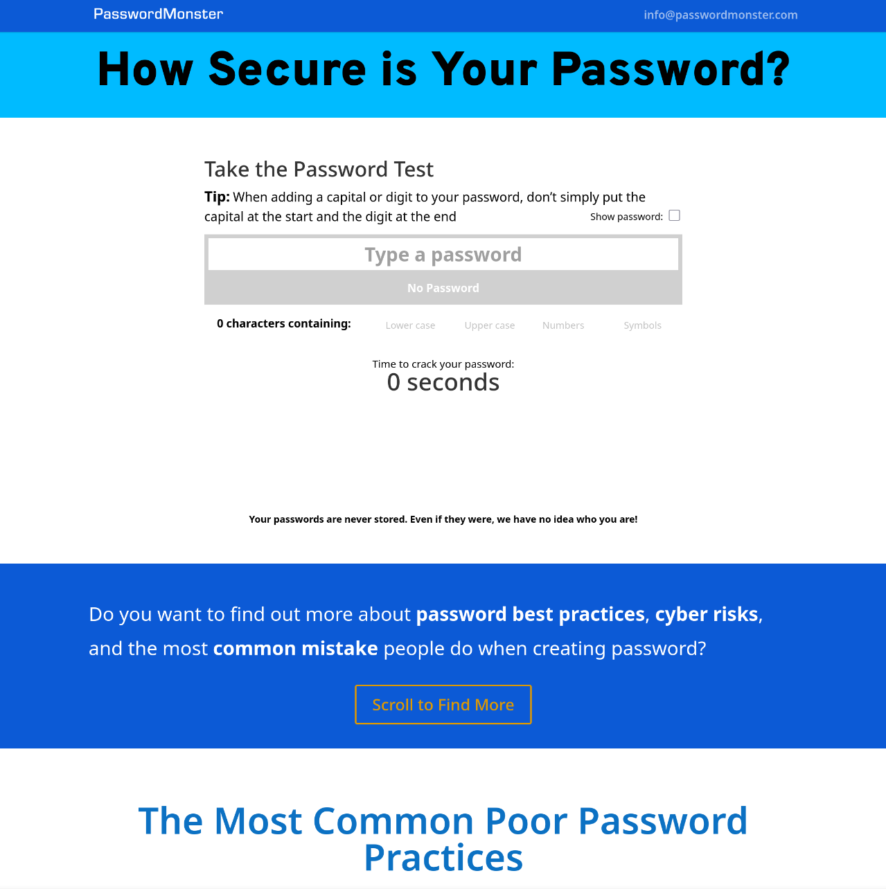

# Elevated Labs Cyber Security Internship

# Task 1 
## Creating Combination of Password
* ThisIsTest
* Lucifer
* Magnate@123
* ThisIsVeryHardPassword@123
* LuciferIsIdiot!#%123
* IDontKnowWhatTheHellIsThis@$^12345

# Task 2
## Testing Each Password on Password Checker
Online Tool Used : www.passwordmonster.com

# Task 3
## Testing Password and Noting their strength
* **ThisIsTest** : Very Weak Takes 2.29 seconds to crack (contains very common word)
* **Lucifer** : Very Weak Takes 0.1 seconds to crack (contains very common word)
* **Magnate@123** : Medium Takes 7 hours to crack (contains 2 dictionary words with sequence of characters)
* **ThisIsVeryHardPassword@123** : Medium Takes 8 days (contains 5 dictionary words with sequence of characters
* **LuciferIsIdiot!#%123** : Very Strong Takes 33 years to crack (contains 3 special characters)
* **IDontKnowWhatTheHellIsThis@$^12345** : Very Strong Takes 5 Million Years to crack (Contains 3 special characters with 5 numbers and uppercase, lowercase characters very highly complex)

# Task 4
## Identify Best Practices for Creating Strong Passwords
* Create Lengthy Password - This makes cracker take more time to crack password
* Use Special Symbols - This is will password more unique and unpredictable
* Use uppercase and lowercase characters - Makes password lengthy 
* Avoid Personal Information during creating password
* Avoid using common words in password creation

# Task 5
## Tips learned from evaluation
* Using Complex Password
* Avoid Personal Information 
* Password should be between 12-20 depending upon how much sensitive data that account holds
* Use Special Symbols'
* Come up with random words

# Task 6
## Understanding Common Password Attacks
### Bruteforce Attack :
Bruteforce attack is the type of password crack attack where the cracker will use every combination of characters in order to guess the password 
#### How it works :
* Cracker will come up with list of random passwords made from combination of characters, special symbols and numbers 
* Using the list of password the cracker will try every password on the database in order to guess the password
* If the password matches then the cracker will able to gain access to the system

#### How to Mitigate this attack :
* Using WAF like Cloudflare which provides DDoS protection will able to block the excess password request which will provide security
* Using Combination of Bash Scripting and Ansible we can able to create script which will track the user login tries and alerts the admin about potential bruteforce attack
* Using Strong Passwords which makes hard for cracker to crack the password
* Using Complex Password will Make password more unique 
* Using techniques like Hashing and Salting will provide more security

### Dictionary Attack
Dictionary Attack is the type of password cracking attack which the cracker creates a file which contains list of password which is tailored to target 

#### How it works?
* The cracker creates a file which contains list of password which is very specific to target (Ex: If the target name is John & He has dog then the password would be cutetommy@123) 
* This makes the password more narrow and the chances of accessing the account increases for cracker

#### How to Mitigate this attack:
* Using Complex Password will make cracker hard to crack
* Using Password which is not personal information will make cracker unable to crack the password
* Using MFA (Multi Factor Authentication) will adds extra layer of security 

### Rainbow Table
Rainbow Table is the type of attack which is similar to Dictionary attack but instead of storing password in a file it contains the list of hash which was previously cracked to crack the password

#### How it works
* The cracker stores the list of hashes which were previously leaked during to large scale attack conducted by entity to a company 
* The cracker will match the password's hash (which was previously got from target) to hashes in the list
* If the hash matches then the user will get to know that this is the password

#### How to Mitigate this attack:
* Using MFA
* Using Salting
* Using Passwordless Authentication
* Using Complex Hashing Algorithm that is hard to crack

# Task 7
## Summarize how password complexity affects security
* Using Complex Password will make the hash more unique which will make cracker hard to crack the password
* This will ensure that longer time taken and resources will be used in order to crack the password
* With Advance techniques such as Salting and Hashing this will create confusion and diffusion which will add extra layer of security
* This will reduce the chances of data breches thus providing security
